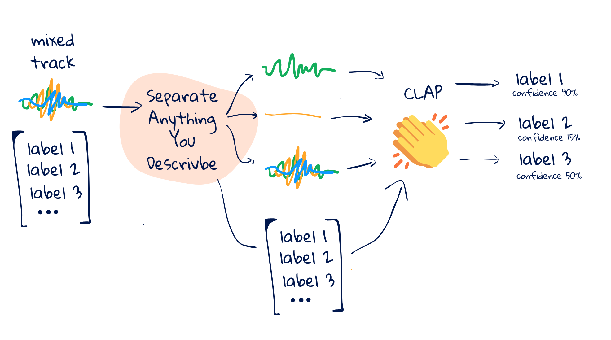
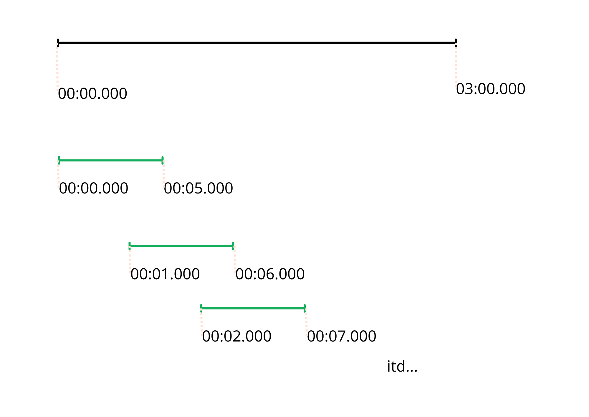
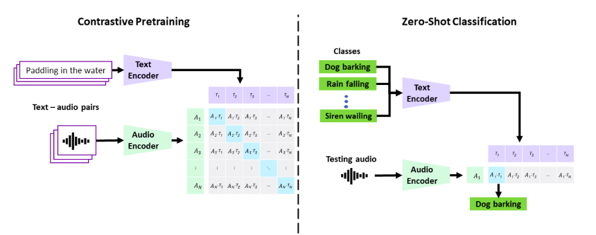

# Audio Component Classifier

### Project Domain
The aim of the project is to create an audio component classifier capable of recognizing various audible sounds simultaneously in a single recording. For example, if the recording contains the sounds of keys, a keyboard, and rain, the classifier will be able to identify these three sounds.

The project combines audio classification with the *cocktail party problem*, which involves separating multiple sources of sound that have been recorded simultaneously, with minimal or no knowledge about these sources.

### Methods

1. **Separating audio from video using MoviePy**:
The method for audio extraction takes the video path as input, creates an output filename with a .wav extension, extracts the audio, saves it to the new file, and returns the output file path.

2. **Creating audio chunks based on predefined time window**:
The process works by first defining the desired length for each audio chunk, typically measured in milliseconds (e.g., 1 second, 2 seconds). This chosen length is called the "segment length."  You can optionally define an "overlap" value, also in milliseconds. This specifies how much the window should overlap itself as it "slides" through the audio file, similar to how a cookie cutter might slightly overlap when making cuts. Overlap can be beneficial for certain machine learning tasks.

As the method iterates through the entire audio file, it takes "slices" of the audio data based on the chosen segment length. For each slice, the actual audio data is extracted and stored as a separate chunk. The method can also optionally record the start and end times (in milliseconds) for each segment. This allows you to associate the chunks with specific parts of the original audio if needed.

3. **Separate Anything You Describe Model for audio component extraction** 
*Separate Anything You Describe* is an architecture that utilizes text prompt vector encoding in a shared space with audio files. It enables zero-shot separation. The trained model is available on GitHub.

Language-Assisted Source Separation (LASS): LASS is a novel paradigm for computational scene analysis (CASA). LASS aims to separate a target sound from an audio mixture based on a natural language query, providing a natural and scalable interface for digital audio applications. Recent work on LASS, despite achieving promising separation performance on specific sources (e.g., musical instruments, limited classes of audio events), is unable to separate audio concepts in the open domain. In this work, we will employ AudioSep, a baseline model for open-domain sound source separation using natural language queries. AudioSep exhibits high separation performance and impressive zero-shot generalization capability using audio captions or text labels as queries, significantly outperforming previous audio and language query-based sound separation models.

4. **Microsoft CLAP for classifying extracted components**: 
[CLAP (Contrastive Language-Audio Pretraining)](https://ieeexplore.ieee.org/abstract/document/10095889) is a model created by Microsoft that uses contrastive language to classify audio. This approach leverages the relationship between labels and sounds, i.e., the relationship between language and audio. 
CLAP is available as a pre-trained model, which can be used to compute embeddings of words and audio in a unified vector space. This allows calculating distances between an audio vector and a text vector, which then helps determine the most appropriate label for a given sound sample. 

The model was trained on 128 thousand pairs of audio and texts, and then tested on 16 different tasks of sound, music, and speech classification. CLAP achieves high performance in classification without the need for prior training on labeled data (**zero-shot classification**).
This model will be used to classify previously separated audio component.

5. **Creating Video Subtitle File with Audio Captions**
SubRipper Format (.srt): The SubRipper format, commonly known as SRT, is widely supported by subtitle converters and players. It features a concise and easy-to-understand structure. When opened in a text editor, an SRT file displays the time the text appears and its corresponding subtitles. This format is widely compatible and can be edited without difficulty.

Each segment in an SRT file consists of three main parts:

*Sequence Number*: This is a marker indicating which subtitle comes first, second, third, etc.
*Timing Information*: This part tells the video player when to display the subtitles and when to remove them.
*Text*: This is the actual subtitle, the words that will be visible on the screen, e.g., spoken dialogue or sound descriptions.

### Sources
- Liu, X., Kong, Q., Zhao, Y., Liu, H., Yuan, Y., Liu, Y., Xia, R., Wang, Y., Plumbley, M. D., & Wang, W. (2023). Separate anything you describe. [https://doi.org/10.48550/ARXIV.2308.05037](https://doi.org/10.48550/ARXIV.2308.05037)
- Elizalde, B., Deshmukh, S., Ismail, M. A., & Wang, H. (2023). Clap learning audio concepts from natural language supervision. ICASSP 2023 - 2023 IEEE International Conference on Acoustics, Speech and Signal Processing (ICASSP), 1–5.[https://doi.org/10.1109/ICASSP49357.2023.10095889](https://doi.org/10.1109/ICASSP49357.2023.10095889)
- Microsoft CLAP Model on GitHub: (https://github.com/microsoft/CLAP.)
- GeeksforGeeks: [Blind source separation using FastICA in Scikit Learn](https://www.geeksforgeeks.org/blind-source-separation-using-fastica-in-scikit-learn/)

#### *Authored by Inga Dyląg, Paulina Skrzypczak, Karolina Źróbek*