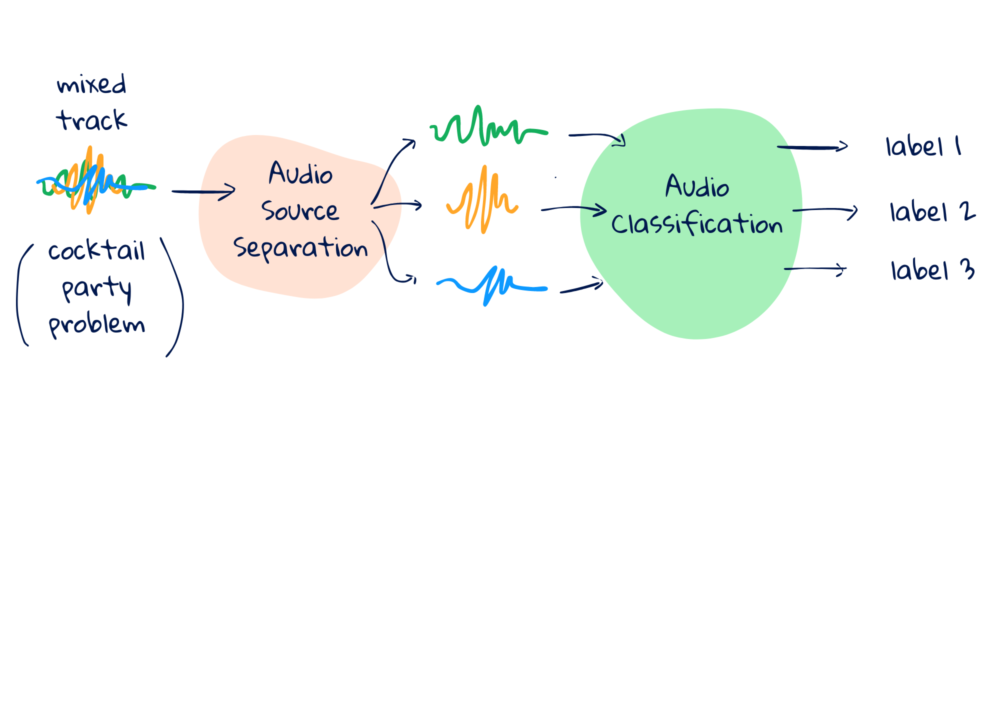

[](https://colab.research.google.com/drive/1hKc2AH5miyDkNVUemvtu7PHIyhpnTmiT?usp=sharing)

# Audio-component-classifier



## About
This project tackles the challenge of recognizing various sounds simultaneously within a single audio recording. Inspired by the "cocktail party problem," our approach combines audio classification with techniques for separating mixed audio sources.

The proposed method involves:

1. Extracting audio from video using `moviepy`.
2. Segmenting the audio into smaller chunks using a predefined time window.
3. Separating audio components within each chunk using the [Separate Anything You Describe model](https://github.com/Audio-AGI/AudioSep) and leveraging AudioSep, a natural language-based sound separation approach.
4. Classifying the separated components using [Microsoft's CLAP model](https://github.com/microsoft/CLAP), which utilizes contrastive language to categorize audio based on pre-trained text-audio relationships.
5. Generating video subtitles with audio captions using the SubRipper (.srt) format.

This framework enables the identification of multiple sounds within a complex audio scene, facilitating applications like automated audio annotation and content indexing.

## Preparation
1. Clone the reposotory and install dependencies:

```bash
  git clone https://github.com/paulinaskr33/Audio-component-classifier
```
```bash 
  pip install torchlibrosa==0.1.0 gradio==3.47.1 gdown lightning ftfy braceexpand webdataset soundfile wget h5py transformers==4.28.1 && \
  pip install msclap
```

## Generating subtitles (TODO)
(to be added python packedge wrapper)

## Examples 
See Google Colab notebook for example use. 


## Acknowledgements
- Liu, X., Kong, Q., Zhao, Y., Liu, H., Yuan, Y., Liu, Y., Xia, R., Wang, Y., Plumbley, M. D., & Wang, W. (2023). Separate anything you describe. [https://doi.org/10.48550/ARXIV.2308.05037](https://doi.org/10.48550/ARXIV.2308.05037)
- Elizalde, B., Deshmukh, S., Ismail, M. A., & Wang, H. (2023). Clap learning audio concepts from natural language supervision. ICASSP 2023 - 2023 IEEE International Conference on Acoustics, Speech and Signal Processing (ICASSP), 1–5.[https://doi.org/10.1109/ICASSP49357.2023.10095889](https://doi.org/10.1109/ICASSP49357.2023.10095889)
